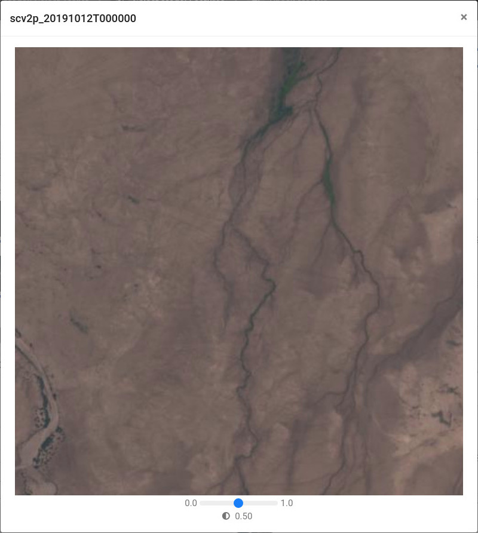



Distil, a system developed by [Uncharted Software](https://uncharted.software) based on research funded by the D3M program, is a mixed-initiative modeling workbench that enables subject matter experts to discover underlying dynamics of complex systems and generate data-driven models using an interactive analytic-question-first workflow. To maximize the combinatorial power of human/machine intelligence, Distil incorporates semantic data discovery, enrichment, analytic model recommendation and automated visualization to facilitate understanding of data and models. 

Through Distil, SMEs visually explore and understand heterogeneous data sources related to analytic objectives, express the objectives using an intuitive visual vocabulary and interact with, understand, curate and refine resultant machine-inferred data models. Distil focuses on visual question decomposition into quantifiable facets that recommender services compose into user-tailorable analytic workflows by interfacing with model construction components.

## Design philosophy ##

Distil has been designed to empower domain experts with the following principles: 

- **Data-Driven Model Discovery**: Guide machine intelligence to build predictive models that classify or project complex real-world processes.
- **Ease of Use**: Apply subject matter expertise with no data science knowledge needed.
- **Simple Search and Exploration**: Describe a problem in natural language to quickly find all relevant data. Filter records as needed.
- **Model Comparisons**: Generate and compare multiple models of the problem at once to understand which is the best fit and determine how features in the data influence the target variable.

## Features ##

**Data Exploration**. Search for keywords, values or features in available datasets and models or upload a custom CSV/ZIP. Use natural language queries to describe goals. For the selected dataset, correct automatically inferred feature data types and choose the feature for which you want to build predictive models. Augment features to build complex timeseries or geocoordinate features.

    

        

            <figure>
                
            </figure>
            

                
                
            

        

        

            <figure>
                
            </figure>
            

                
                
            

        

    

**Select Model Features**. Choose features that may predict the selected target. Interactive highlighting reveals relationships between features. Automatic variable ranking sorts features by importance to the target. Data clustering groups data to reveal outliers and commonalities. Augment with other sources via automatically suggested joins. Exclude noisy or irrelevant data samples to get the best results.

    

        

            <figure>
                
            </figure>
            

                
                
            

        

        

            <figure>
                
            </figure>
            

                
                
            

        

        

            <figure>
                
            </figure>
            

                
                
            

        

    

**Check Models**. Review classification, regression and timeseries forecasting model results. Features are displayed in terms of strength to the model as a whole and importance to individual predictions. Compare results with ground truth and select variables or predictions to understand how samples impact accuracy. Iteratively build models and apply them to new data or forecast beyond the dataset.

    

        

            <figure>
                
            </figure>
            

                
                
            

        

        

            <figure>
                
            </figure>
            

                
                
            

        

    

**Remote Sensing**. Train a classifier to assign labels to multi-spectral satellite images to solve problems such as land use. Perform interactive image similarity searches to generate a ranked list of images that match an input set. View results on a map, ranked by similarity or confidence.

    

        

            <figure>
                
            </figure>
            

                
                
            

        

        

            <figure>
                
            </figure>
            

                
                
            

        

        

            <figure>
                
            </figure>
            

                
                
            

        

    

## Demo ##

The following demo video shows how Distil's remote sensing capabilities can be used to train a classifier that predicts land use.

  <video controls style="margin: 0 auto; max-height: 400px">
    <source src="vid/distil-locust-remote-sensing-vo.mp4?{{site.time | date: '%s%N'}}" type="video/mp4">
      Download <a href="vid/distil-locust-remote-sensing-vo.mp4?{{site.time | date: '%s%N'}}" download>video</a>.
  </video>

## Repositories ##

Distil was developed as part of DARPA's <a href="https://datadrivendiscovery.org/">D3M ecosystem</a>, and consists of the following main repositories:

- [Distil](https://github.com/uncharted-distil/distil), a web-based application compliant with the [automl-rpc](https://gitlab.com/datadrivendiscovery/automl-rpc) interface.
- [Distil AutoML](https://github.com/uncharted-distil/distil-auto-ml), a template-based research AutoML system compliant with the [automl-rpc](https://gitlab.com/datadrivendiscovery/automl-rpc) interface.
- [Distil Primitives](https://github.com/uncharted-distil/distil-primitives), a collection of general transformation, analysis and learning primitives designed for use in the D3M ecosystem.
- [KUNGFU Primitives](https://github.com/kungfuai/d3m-primitives), additional D3M-compliant primitives for specialized transformation, analysis and learning.

## Contributors ##

<table class="contributors">
    <colgroup>
       <col span="1" style="width: 50%;">
       <col span="1" style="width: 50%;">
    </colgroup>
    <tr>
        <td>
            <figure>
                
            </figure>
            
<a href="https://kungfu.ai/">KUNGFU.AI</a> is a leading-edge AI professional services firm based in Austin, TX. We build robust, scalable state-of-the-art AI solutions and maintain the models in production in our clients' environments. Our key AI/ML capability areas include computer vision, natural language processing, and predictive analytics. As a subcontractor to Uncharted Software under the DARPA D3M program, KUNGFU has developed a robust set of machine learning primitives, with a particular focus on multivariate time series forecasting and remote sensing using multispectral satellite imagery.

        </td>
    </tr>
    <tr>
        <td>
            <figure>
                
            </figure>
            
<a href="https://www.jataware.com">Jataware</a> is a research and development company focused on software engineering, data science, machine learning and high performance computing. We provide technology consulting services and digital solutions for a wide range of problem sets within government and commercial spaces. As a member of Uncharted's D3M team, Jataware has developed components for: computer vision tasks operating on standard image and multispectral satellite image data; time series, audio and text classification problems; and graph analytics.

        </td>
    </tr>